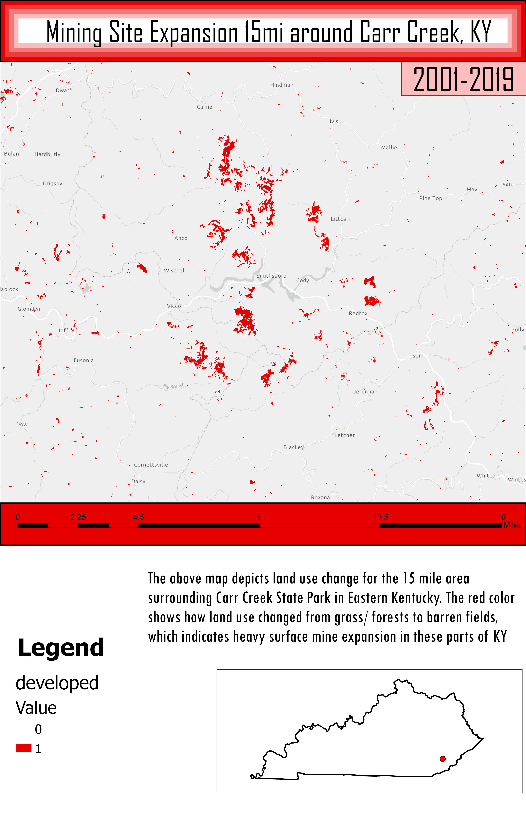

# Mining-Expansion-Near-Carr-Creek

# Carr Creek, Eastern Kentucky
## Focusing on the land use differences between 2001 and 2019 mining

In 2001, the area shown on this map was still predominatly forested, with lush greenery and natural resources all around Carr Creek. Interestingly, the areas to the north and south of the state park show many signs of surface mine expansion, resulting in an increase in barren fields, due to poor restoration practices. 

     
*Mining Expansion 2001-2019*

[Link to high-resolution version](Layout.pdf)     

Created by Sam Sapeta, an NRES student at the University of Kentucky
